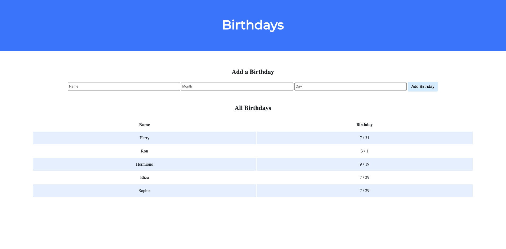

# Birthday Tracker
Introducing Birthday Tracker, the sleek and user-friendly web application for effortlessly managing and tracking birthdays, featuring an attractive Bootstrap-based interface, all powered by Python and Flask.

## Project Objectives
1. **User-Friendly Birthday Database**: Create a straightforward and easy-to-use platform for users to input and store important birthdays.

2. **Comprehensive Birthday Database**: Build a robust database to allow users to maintain a detailed list of birthdays.

3. **Intuitive Design**: Design the user interface with a clean and intuitive layout to ensure a pleasant and efficient user experience using Bootstrap.


## Screenshots



## Demo

- [WATCH DEMO HERE](https://youtu.be/5Z6bHT7p1Ys)

## Installation
To set up, follow these steps:

1. Clone the repository to your local machine:

   ```bash
   git clone git@github.com:elizayounger29/birthday_website.git

2. Navigate to the project directory:

    ```bash
    cd birthdays

## Deployment

1. Install the project's dependencies using pipenv (If you do not already have pip and pipenv installed you must do so before proceeding):

    ```bash
    pipenv install

2. Run birthday tracker:

    ```bash
    flask run

## Exit

1. Once finished, close the window and in your terminal type the following:

    ```bash
    ctrl c
